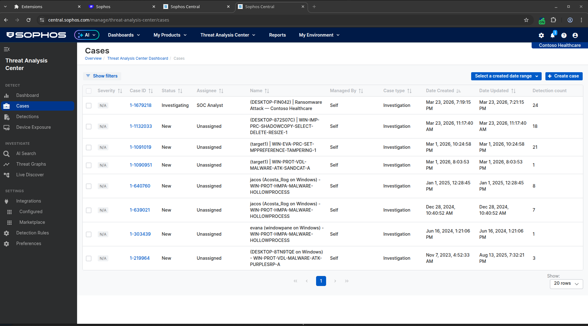
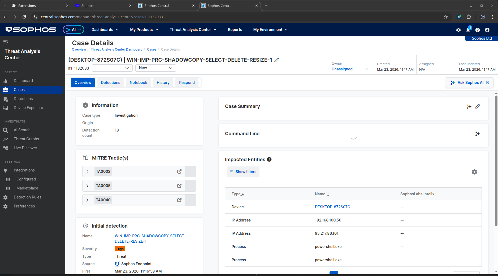
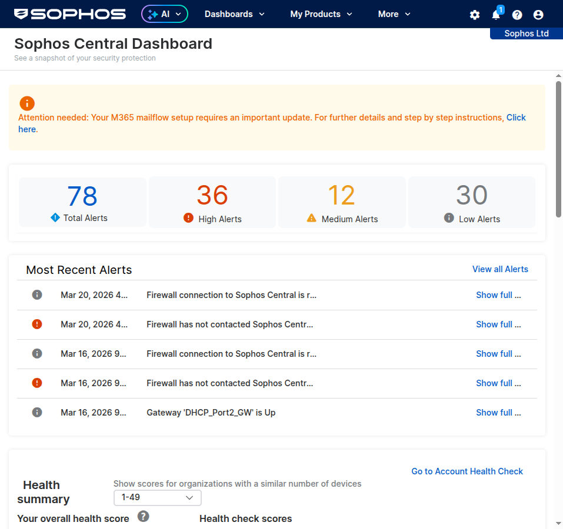
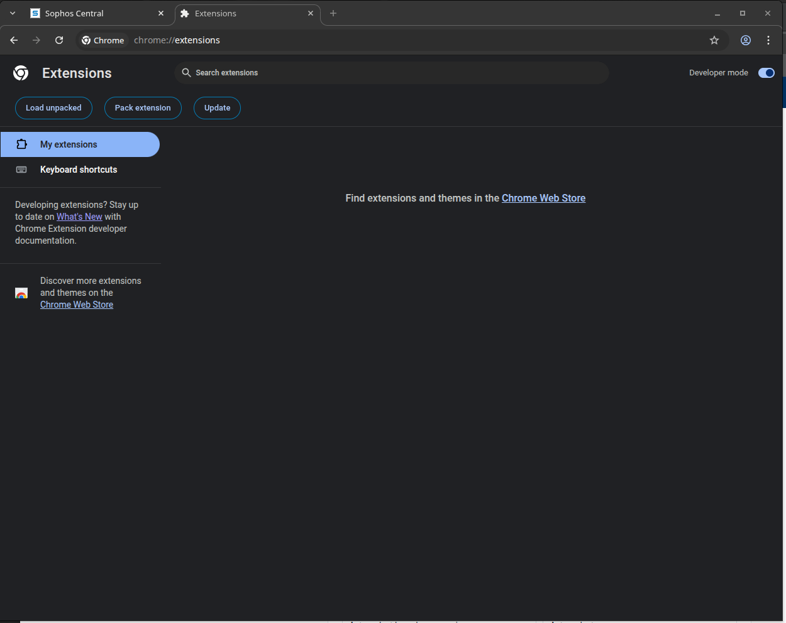
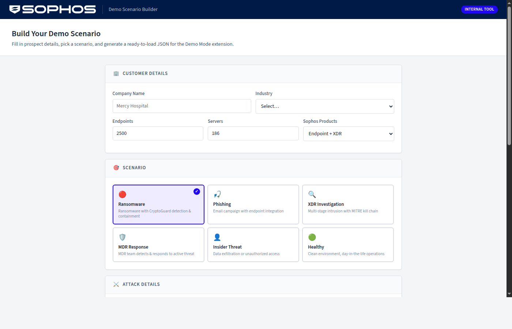
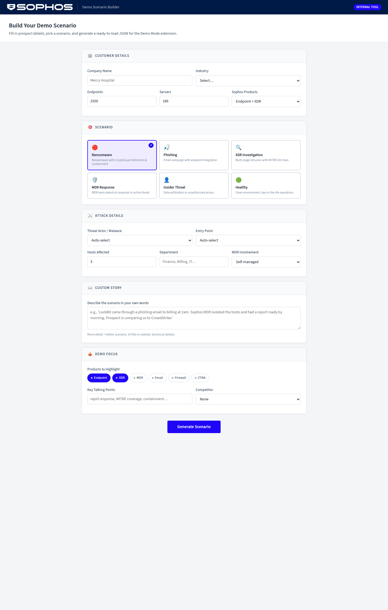

# Sophos Central Demo Injector

A Chrome extension that injects realistic demo data into the **live Sophos Central UI**. Real product, fake data — every pixel is authentic. Built for Sophos Sales Engineers who need compelling, customer-specific demos without maintaining separate demo environments.

---

## Table of Contents

- [Why This Exists](#why-this-exists)
- [How It Works](#how-it-works)
- [Installation](#installation)
- [Quick Start](#quick-start)
- [Built-in Scenarios](#built-in-scenarios)
- [Custom Scenarios](#custom-scenarios)
- [AI Scenario Generator](#ai-scenario-generator)
- [Industry Presets](#industry-presets)
- [AI Demo Script Generator](#ai-demo-script-generator)
- [Scenario Library](#scenario-library)
- [Competitive Battle Cards](#competitive-battle-cards)
- [Post-Demo Follow-Up](#post-demo-follow-up)
- [Prospect Enrichment](#prospect-enrichment)
- [What-If Mode](#what-if-mode)
- [Demo Recording](#demo-recording)
- [Floating Demo Badge](#floating-demo-badge)
- [Timed Events](#timed-events)
- [Scenario Validator](#scenario-validator)
- [Demo Walkthroughs](#demo-walkthroughs)
- [Best Practice Tips](#best-practice-tips)
- [What Gets Overridden](#what-gets-overridden)
- [Known Caveats](#known-caveats)
- [Troubleshooting](#troubleshooting)
- [Customizing Scenarios](#customizing-scenarios)
- [Architecture Deep Dive](#architecture-deep-dive)
- [Distribution](#distribution)
- [Roadmap](#roadmap)
- [File Structure](#file-structure)

---

## Screenshots

### Demo Mode Active — Cases Page
The extension injects a fake ransomware case into the real Sophos Central Cases page. Notice "Contoso Healthcare" in the top right and the injected case at the top of the list with 24 detections.



### Case Detail View
Clicking into a case shows MITRE ATT&CK tactics (TA0002, TA0005, TA0040), impacted entities, detection details, and the investigation timeline — all generated by the extension.



### Sophos Central Dashboard (Before Demo Mode)
The real Sophos Central dashboard showing actual alert counts and health summary.



### Chrome Extensions Page
Extension loaded in developer mode showing version and permissions.



### AI Scenario Builder
The intake website where SEs fill out prospect details and generate custom scenarios with AI. Uses official Sophos branding.





---

## Why This Exists

Every Sophos SE faces the same problem: you need to show a prospect what Sophos Central looks like with **their** company name, **their** scale (thousands of endpoints), and a **realistic threat scenario** — but your actual Sophos Central tenant has 2 test endpoints and no real alerts.

**Previous options were bad:**
- **Screenshots/slides:** Not interactive. Prospect can't click around. Feels like a pitch, not a product.
- **Recorded videos:** Same problem. Can't answer "what happens if I click here?"
- **Shared demo tenants:** Stale data. Other SEs modify it. Never matches the prospect's industry.
- **Lab environments:** Takes hours to set up. Alerts get old. Hard to customize per prospect.

**This extension solves it:**
- The prospect sees **real Sophos Central** — `central.sophos.com` in the URL bar
- Every pixel, animation, menu, and button is **the actual product**
- Data is **customized per demo** — their company name, their scale, their industry
- **Zero setup time** — toggle on, pick a scenario, go
- **Zero risk** — nothing is sent to Sophos Central, all writes are blocked
- **Works anywhere** — airplane, customer site, coffee shop, your desk

---

## How It Works

### The 30-Second Version

Sophos Central is a React web app. When you visit `central.sophos.com`, your browser downloads the React application, which then calls APIs to fetch data (alerts, devices, health scores, etc.). The React app renders whatever data the API returns.

**This extension sits between the API responses and React.** It lets the real API call happen, waits for the real response, then **modifies the JSON data before React sees it**. React renders the modified data as if it were real.

### The Technical Version

```
Without Extension:
  React calls fetch("/api/alerts") 
    → Sophos API responds: { items: [], total: 0 }
    → React renders: "No alerts"

With Extension ON:
  React calls fetch("/api/alerts")
    → Sophos API responds: { items: [], total: 0 }
    → Extension intercepts response
    → Extension injects: { items: [fake ransomware alert], total: 1 }
    → React renders: "1 critical alert: CryptoLocker detected on DESKTOP-FIN042"
```

The extension replaces the browser's global `fetch()` and `XMLHttpRequest` with custom versions that:

1. **Let the real API call happen** — your browser talks to Sophos Central normally
2. **Read the response** — check if this URL matches any interception rules
3. **Modify the JSON** — inject fake alerts, change tenant names, override counts
4. **Return the modified response** — React gets our version, not the original
5. **Block all writes** — POST/PUT/DELETE requests return fake `{ success: true }` without ever reaching Sophos

The extension also includes a **DOM observer** for pages that load data through mechanisms we can't intercept at the API level. It watches for specific UI elements and overrides their content after rendering.

### What Each File Does

| File | Role |
|------|------|
| `interceptor.js` | **The core.** Runs in the page's JavaScript context. Overrides `fetch()` and `XHR`. Contains all interception rules, data generators, floating demo badge, and timed events. (~1,300 lines) |
| `bridge.js` | **The messenger.** Runs in the extension's isolated world. Relays settings from the popup to the interceptor via DOM events. |
| `service-worker.js` | **The brain.** Manages state in `chrome.storage`. Loads scenario JSON files. Handles import/export. Shows the ON badge. |
| `popup.html/js` | **The UI.** The popup you see when clicking the extension icon. Scenario picker, customer name input, toggle switch. |
| `scenarios/*.json` | **The data.** Each file defines a complete demo scenario — alerts, cases, detections, health scores, audit logs, etc. |

---

## Installation

### Prerequisites
- Google Chrome (any recent version)
- A Sophos Central account (any tier — the extension works with whatever you have)

### Step-by-Step

1. **Get the extension files**
   ```bash
   git clone https://github.com/jasoaco79/sophos-demo.git
   ```
   Or download and unzip the repository.

2. **Open Chrome Extensions**
   - Navigate to `chrome://extensions/`
   - Or: click the three dots menu (⋮) → Extensions → Manage Extensions

3. **Enable Developer Mode**
   - Look for the **Developer mode** toggle in the top right corner
   - Turn it **ON**
   - Three buttons appear: "Load unpacked", "Pack extension", "Update"

4. **Load the Extension**
   - Click **"Load unpacked"**
   - Navigate to the `extension/` folder inside the repository
   - Click **Open** (or **Select Folder**)
   - You should see "Sophos Central Demo Mode" appear as a card on the extensions page

5. **Pin the Extension Icon**
   - Click the puzzle piece icon (🧩) in Chrome's toolbar (top right)
   - Find "Sophos Central Demo Mode" in the list
   - Click the pin icon (📌) to keep it visible

6. **Verify**
   - Go to `https://central.sophos.com` and log in
   - Click the 🎯 extension icon — you should see the scenario picker popup
   - The extension shows "Inactive" until you toggle it on

### Updating
When you pull new code:
1. Go to `chrome://extensions/`
2. Find the Sophos Central Demo Mode card
3. Click the **refresh icon** (🔄) on the card, or click **"Update"** at the top

---

## Quick Start

1. Log into [Sophos Central](https://central.sophos.com)
2. Click the 🎯 extension icon in Chrome's toolbar
3. Select **🔴 Ransomware Attack** from the dropdown
4. Type your prospect's company name (e.g., "Mercy Hospital")
5. Set their endpoint count (e.g., 4200) and server count (e.g., 300)
6. Toggle **ON**
7. Click **🔄 Apply & Reload Sophos Central**

**What happens:**
- Top right shows "Mercy Hospital" instead of your real tenant name
- Dashboard shows 4,200 endpoints with adjusted health scores
- Alerts page shows ransomware alerts on DESKTOP-FIN042
- Cases page shows an active investigation with MITRE mapping
- Threat Graphs shows a process tree with the malware kill chain
- Audit logs show device isolation and cleanup actions
- A floating demo badge appears in the bottom-right corner showing the active scenario, customer name, and interception count
- All "Isolate Device" / "Clean" / "Delete" buttons return fake success

**When you're done:**
- Toggle **OFF** in the popup
- Reload the page — your real data is back, untouched

---

## Built-in Scenarios

The extension ships with **9 built-in scenarios** covering all major demo use cases:

### 🔴 Ransomware Attack
**Story:** CryptoLocker ransomware was delivered via phishing email. Sarah Chen in Finance downloaded `invoice_march2026.exe`. CryptoGuard blocked the encryption attempt. Shadow copies were targeted. Tamper Protection stopped the malware from disabling real-time scanning.

**Best for:** Showing endpoint protection, CryptoGuard, Tamper Protection, incident response workflow.

**What you'll see:**
- 4 alerts (high + medium severity)
- 1 active investigation case with MITRE ATT&CK mapping (T1486, T1490, T1059)
- 2 XDR detections with full command-line detail
- Threat graph showing the malware process tree
- Audit logs: device isolation, CryptoGuard activation, tamper protection trigger
- Live Discover: pre-run query showing suspicious PowerShell and shadow copy deletion processes
- Health score: 72 (dropped from attack)

**Demo talking points:**
- "CryptoGuard stopped the encryption in real-time — 47 files protected"
- "Look at the MITRE mapping — we can see the full attack chain"
- "Tamper Protection blocked the attacker from disabling our agent"
- "The investigation case was auto-generated with all the context an analyst needs"

---

### 🟠 Phishing Campaign
**Story:** A targeted phishing campaign hit 47 employees with credential harvesting emails from `secure-login-verify[.]com`. Sophos Email blocked most at the gateway. 12 were quarantined post-delivery via clawback. One user clicked — Sophos Web Protection on the endpoint blocked the malicious URL.

**Best for:** Showing Sophos Email, endpoint web protection, email + endpoint integration, post-delivery remediation.

**What you'll see:**
- 3 alerts (email gateway + endpoint web block)
- 1 investigation case linking email and endpoint detections
- 2 detections (gateway block + endpoint URL block)
- Email history: 5 sample emails (blocked/quarantined/delivered-then-clawed-back)
- Quarantine: 3 items with release/block options
- Email stats: 47 threats blocked, 1,284 scanned, 89 spam
- Audit logs: campaign blocked, post-delivery remediation, endpoint URL block
- Health score: 89

**Demo talking points:**
- "47 emails blocked before any user saw them"
- "Even the one email that got through — the endpoint caught the click"
- "Post-delivery clawback removed 12 emails that were already in mailboxes"
- "Email and endpoint work together — one detection, full visibility"

---

### 🔵 XDR Investigation
**Story:** A multi-stage intrusion starting with a browser exploit on DESKTOP-MKT003 (Marketing). The attacker exploited CVE-2026-1234 in Edge, injected a Cobalt Strike beacon, moved laterally to the domain controller (SRV-DC01) via SMB, then staged 2.4GB of customer data on the database server (SRV-DB02). Exfiltration was blocked.

**Best for:** Showing XDR, threat hunting, MITRE kill chain, cross-host correlation, Live Discover.

**What you'll see:**
- 3 alerts across 3 hosts (exploit, lateral movement, data staging)
- 1 active case with full MITRE mapping (5 tactics: Initial Access → Persistence → Lateral Movement → Collection → Exfiltration)
- 2 detections with detailed raw data
- Threat graph showing multi-host attack flow
- Audit logs: 3 device isolations, credential reset (3 compromised accounts), firewall rule blocking C2
- Live Discover: query across 25 endpoints showing beacon activity, AD enumeration, data export
- Health score: 84

**Demo talking points:**
- "Look at this kill chain — 5 MITRE tactics mapped automatically"
- "The attacker moved from Marketing to the Domain Controller to the database server"
- "XDR correlated detections across all 3 hosts into a single investigation"
- "Live Discover lets us query every endpoint in real-time — here we hunted for the Cobalt Strike beacon"
- "Exfiltration was blocked before any data left the network"

---

### 🛡️ MDR Response
**Story:** Sophos MDR detected a ransomware attack at 2am, isolated affected hosts within 8 minutes, and delivered a full incident report by morning. The customer slept through the entire thing.

**Best for:** Showing the value of managed detection and response, 24/7 coverage, SLA-level response times, and the "sleep through the night" pitch.

**What you'll see:**
- 5 alerts across multiple hosts
- 1 MDR-managed case (`managedBy: "mtr"`) with Sophos MDR Team as assignee
- 3 detections with command-line telemetry
- Case timeline showing MDR team actions: triage, isolation, investigation, containment
- Audit logs with MDR-initiated device isolations and credential resets
- Health score: 76

**Demo talking points:**
- "While you were asleep, our MDR team detected this at 2:07 AM"
- "8 minutes from detection to host isolation — that's our SLA"
- "Look at this timeline — every action the MDR team took is documented"
- "By 6 AM they had a full report ready for your security team"

---

### 👤 Insider Threat
**Story:** Disgruntled employee in IT exfiltrating sensitive data via personal cloud storage. USB activity, large file transfers, and off-hours access detected by XDR.

**Best for:** Showing data loss prevention, user behavior analytics, XDR correlation of non-malware threats.

**What you'll see:**
- 4 alerts (USB device, cloud upload, off-hours access, large file transfer)
- 1 investigation case with insider threat indicators
- 2 detections showing data movement patterns
- Audit logs: account activity, access patterns
- Health score: 91 (high — no malware, just policy violations)

**Demo talking points:**
- "No malware here — this is a trusted employee going rogue"
- "XDR correlates the USB activity with the cloud upload — it's one story"
- "Off-hours access from a machine that normally isn't used at 11 PM"
- "This is why endpoint protection alone isn't enough — you need XDR visibility"

---

### 📧 Business Email Compromise (BEC)
**Story:** CEO impersonation attack targeting CFO with urgent wire transfer request. Sophos Email detects impersonation, endpoint blocks credential harvesting page.

**Best for:** Showing Sophos Email's impersonation detection, VIP protection, and email + endpoint integration against social engineering.

**What you'll see:**
- 3 alerts (email impersonation + endpoint web block)
- 1 investigation case linking the email and endpoint detections
- 1 detection with email header analysis
- Email history showing the impersonation chain
- Health score: 93

**Demo talking points:**
- "The attacker spoofed the CEO's name — but look at the sending domain"
- "Sophos Email's impersonation engine flagged this immediately"
- "Even the credential harvesting page on the endpoint was blocked"
- "BEC causes more financial damage than ransomware — this is why email security matters"

---

### 🔗 Supply Chain Attack
**Story:** Compromised software update from a trusted vendor deploys backdoor across multiple endpoints. Sophos detects anomalous behavior from the legitimate application.

**Best for:** Showing behavioral detection, zero-trust, detection of attacks from trusted software sources.

**What you'll see:**
- 3 alerts across multiple hosts (anomalous behavior from trusted app)
- 1 investigation case with supply chain indicators
- 1 detection with behavioral analysis data
- Health score: 82

**Demo talking points:**
- "This came from a legitimate vendor update — your firewall would never catch this"
- "Sophos detected the anomalous behavior: a PDF viewer shouldn't be spawning PowerShell"
- "Behavioral analysis caught what signatures couldn't — this was a zero-day supply chain compromise"
- "SolarWinds, MOVEit, 3CX — this is the attack pattern that keeps CISOs up at night"

---

### 🧪 Zero-Day Exploit
**Story:** Previously unknown vulnerability exploited in the wild. Sophos detects the exploit via behavioral analysis and deep learning — no signature existed yet.

**Best for:** Showing the value of AI/ML detection, behavioral analysis, and protection against unknown threats.

**What you'll see:**
- 3 alerts with behavioral and deep learning detections
- 1 investigation case with exploit analysis
- 2 detections with exploit telemetry
- Health score: 85

**Demo talking points:**
- "There was no signature for this — it was discovered today"
- "Our deep learning model detected the exploit behavior in real-time"
- "This is why you need behavioral detection, not just signature matching"
- "By the time the vendor patches this, our customers have been protected for hours"

---

### 🟢 Healthy Environment
**Story:** A well-managed environment with zero alerts, high compliance, and all endpoints protected. Shows what a mature Sophos deployment looks like day-to-day.

**Best for:** "Day in the life" demos, showing operational simplicity, health scoring, compliance posture.

**What you'll see:**
- Zero alerts, zero cases, zero detections
- Health score: 98
- All endpoints healthy and compliant
- Clean email stats

**Demo talking points:**
- "This is what you see when things are working well — green across the board"
- "98% health score means your endpoints are protected, patched, and compliant"
- "When there's nothing to investigate, your team can focus on proactive security"

---

## Custom Scenarios

### Import from File
1. Click 📁 in the popup
2. Select a `.json` scenario file
3. The scenario appears under **"Custom Scenarios"** in the dropdown
4. Customer name and endpoint count auto-populate from the scenario
5. You can still override them in the popup

### Import from Clipboard
1. Click 📥 in the popup
2. Paste the scenario JSON into the text area
3. Click **Import**

### Export a Scenario
1. Select any scenario in the dropdown
2. Click 📤
3. A `.json` file downloads — share it with other SEs

### Delete a Custom Scenario
1. Select the custom scenario
2. Click 🗑️
3. Confirm deletion

---

## AI Scenario Generator

The **Scenario Builder** is a web-based tool that uses AI (Claude Sonnet 4 via Pi SDK) to generate custom scenario JSON from a simple intake form.

### Setup
```bash
cd intake-site
npm link @mariozechner/pi-coding-agent
npm start
```
Opens at `http://localhost:3847`

### How to Use

1. **Customer Details** — Company name, industry, endpoint count, server count, Sophos products
2. **Scenario Type** — Pick from: Ransomware, Phishing, XDR Investigation, MDR Response, Insider Threat, Healthy Environment
3. **Attack Details** — Threat actor (LockBit, BlackCat, etc.), entry point, hosts affected, department targeted, MDR involvement
4. **Custom Story** — Describe your demo in plain English: *"LockBit came in through phishing to billing. MDR detected it at 2am, isolated hosts, had a report by morning."*
5. **Demo Focus** — Which products to highlight, talking points, competitor you're up against
6. Click **Generate Scenario** (~15 seconds)
7. Preview the result (summary stats + full JSON) → **Download .json** → Import into extension

### What the AI Generates
- Realistic alerts with industry-specific hostnames (HIS-SRV for healthcare, POS-TERM for retail)
- MITRE ATT&CK mapping with real technique IDs
- Case with investigation timeline
- Detections with realistic command lines and file paths
- Threat graph data
- Case detail with extra activities (MDR actions if applicable)
- Audit logs matching the story
- Live Discover query results
- Email history (for phishing/BEC scenarios)
- Appropriate health score

### Tips for Better Scenarios
- **Be specific about the story.** "LockBit via phishing to billing at 2am" generates much better data than "ransomware attack."
- **Name the competitor.** If you're up against CrowdStrike, the AI emphasizes Sophos differentiators.
- **Include the department.** "Finance" generates different hostnames and user accounts than "Engineering."
- **Mention MDR if relevant.** Setting MDR involvement to "yes" generates MDR team actions in the case timeline.

---

## Industry Presets

When you select an industry in the AI Scenario Generator, the form automatically loads **industry-specific presets** via the `/api/presets/{industry}` endpoint. This provides contextual enrichment:

| Industry | Compliance | Sample Hostnames | Data at Risk |
|----------|-----------|------------------|--------------|
| Healthcare | HIPAA | HIS-SRV, PACS-WKS, RX-STATION, EHR-DB | Patient records, PHI, medical imaging |
| Financial Services | PCI-DSS, SOX | TRADE-WKS, ATM-SRV, SWIFT-GW, RISK-DB | Financial transactions, customer PII, trading data |
| Manufacturing | IEC 62443, NIST | HMI-STATION, PLC-GW, MES-SRV, SCADA-WKS | Production data, SCADA systems, trade secrets |
| Education | FERPA | LAB-PC, ADMIN-WKS, SIS-SRV, LMS-DB | Student records, research data, financial aid |
| Retail | PCI-DSS | POS-TERM, ECOM-SRV, INV-WKS, WMS-DB | Customer payment data, loyalty info, inventory |
| Government | FISMA, FedRAMP | SECURE-WKS, AGENCY-SRV, CAC-TERM | Citizen PII, classified documents, case files |
| Legal | Attorney-client privilege | ATTY-WKS, DOC-SRV, CASE-MGR | Case files, client communications, billing records |

**What happens automatically:**
- **Department field** auto-fills with the most relevant department for that industry
- **Hint text** appears below the industry dropdown showing compliance framework, sample hostnames, and data types
- The preset data enriches the AI generation prompt, so hostnames and user accounts match the selected industry

---

## AI Demo Script Generator

After generating a scenario, click **📝 Demo Script** to generate a complete **talk track** for your demo. The script is generated by Claude Sonnet 4 and tailored to the specific scenario data.

### What You Get

A markdown document with:
1. **Opening Hook** — A one-paragraph scene-setter to start the demo
2. **Step-by-Step Walkthrough** — Each step includes:
   - Which **page** to navigate to in Sophos Central
   - **What to show** (specific UI elements, data points)
   - **What to say** (exact words in quotes — natural and conversational)
3. **Talking Points** — Key messages to hit at each step
4. **Objection Handlers** — Responses to common prospect questions
5. **Closing Statement** — How to wrap up the demo

### How to Use

1. Generate a scenario first (via the Generate Scenario button)
2. Click **📝 Demo Script** in the result panel
3. Wait ~10-15 seconds for generation
4. Review the talk track in the styled panel
5. **📋 Copy** to clipboard or **💾 Download .md** for offline use

The script references specific data from your scenario — alert names, hostnames, MITRE techniques, health scores — so it matches exactly what the prospect will see during the demo.

**Tip:** Click the button again to toggle the script panel open/closed. If you generate a new scenario, the script resets and you can generate a fresh one.

---

## Scenario Library

Browse all built-in scenarios at **`/scenarios.html`** (linked from the top bar). Each scenario shows:

- **Stats at a glance** — alert count, case count, detection count, health score
- **Tags** — MDR, EMAIL, TIMED, CLEAN badges for quick filtering
- **Three actions per scenario:**
  - **⚡ Make It Mine** — instantly clone with your customer's name, industry, and endpoint count. No AI needed, no API key required. Downloads a ready-to-use JSON file.
  - **💾 Download** — grab the raw scenario JSON as-is
  - **🔀 Remix** — opens the AI generator pre-loaded with this scenario for deeper customization (new threat actor, new industry, etc.)

---

## Competitive Battle Cards

After generating a scenario, click **⚔️ Battle Card** to generate a competitive battle card vs the selected competitor. The AI creates:

1. **Competitor Overview** — product and market position
2. **Where Sophos Wins** — 5-7 specific differentiators
3. **Where They Compete** — honest areas of competitor strength
4. **Common Objections & Responses** — "If they say X, you say Y" pairs
5. **Killer Questions** — questions that expose competitor weaknesses
6. **Pricing Positioning** — how to frame the conversation

The battle card is contextualized to the specific scenario you're demoing — not generic marketing material.

---

## Post-Demo Follow-Up

Click **📧 Follow-Up** after generating a scenario to create a professional follow-up email. Includes:

- A subject line specific to what was shown
- Scenario-specific highlights with data points from the demo
- Clear next steps (POC, technical deep dive, pricing)
- Suggested Sophos resources to attach

Tone is consultative, not salesy. Under 300 words — the prospect can read it in 60 seconds.

---

## Prospect Enrichment

Click **🔍 Enrich** next to the company name field to auto-research the prospect. The AI returns:

- Industry classification, estimated employee/endpoint/server counts
- Compliance frameworks (HIPAA, PCI-DSS, SOX, etc.)
- Recent public breaches (if any)
- Industry-specific risks and suggested threat actors
- Recommended scenario type and demo angle

Auto-fills the form fields (industry, endpoint count, server count, scenario type, story description) so the SE can generate in fewer clicks.

---

## What-If Mode

During a live demo, inject alerts on the fly using keyboard shortcuts:

| Shortcut | Alert Type | Description |
|---|---|---|
| `Ctrl+Shift+1` | Ransomware | CryptoGuard blocks encryption |
| `Ctrl+Shift+2` | Phishing | Credential harvesting link blocked |
| `Ctrl+Shift+3` | Lateral Movement | SMB access with stolen credentials |
| `Ctrl+Shift+4` | Exfiltration | Data upload to external IP blocked |
| `Ctrl+Shift+5` | Isolation | Device automatically isolated |

Alerts appear instantly in the intercepted data, using hostnames from the active scenario. The demo badge flashes red when an event is injected.

**Console access:** `window.__sophosDemo.whatIf("ransomware")` for programmatic injection.

---

## Demo Recording

The extension automatically records your demo session when demo mode is enabled:

- **Pages visited** — URL, title, time entered
- **Time per page** — how long you spent on each view
- **Total duration** — formatted as minutes/seconds
- **Intercept count** — how many API responses were modified

Recording starts when you toggle demo mode ON and stops when you toggle OFF. The summary is stored in `sessionStorage` for the popup to display.

---

## Floating Demo Badge

When demo mode is active, a small **floating badge** appears in the bottom-right corner of the Sophos Central page:

```
🎯 Ransomware Attack | Mercy Hospital | 47 intercepted
```

The badge shows:
- **Scenario name** — which scenario is loaded
- **Customer name** — the company name from popup settings
- **Intercept count** — how many API responses have been modified (updates every 3 seconds)

**Click the badge** to toggle it between full opacity and nearly invisible (15% opacity) — useful when screen-sharing with a prospect. The badge is only visible to the SE (it's rendered in the browser, not in any screenshot API).

**Important:** The badge is there to remind *you* that demo mode is on. During a real demo, either:
- Click it to make it nearly invisible before sharing your screen
- Or position it behind the taskbar / outside the visible area

---

## Timed Events

Scenarios can include **timed events** — alerts or detections that fire at scheduled times during the demo for dramatic "something just happened!" moments.

### How It Works

Add a `timedEvents` array to your scenario JSON:

```json
{
  "timedEvents": [
    {
      "delaySeconds": 60,
      "alert": {
        "severity": "high",
        "description": "CryptoGuard: Ransomware encryption blocked on DESKTOP-FIN042",
        "created_at": "now",
        "category": "malware",
        "type": "Event::Endpoint::Threat::CryptoGuard",
        "data": {
          "endpoint_type": "computer",
          "endpoint_hostname": "DESKTOP-FIN042"
        }
      }
    }
  ]
}
```

- `delaySeconds` — How long after demo mode activates before the event fires (default: 30)
- When the event fires, the alert is injected into the active scenario's alert list
- The **demo badge flashes red** for 3 seconds to catch the SE's attention
- Summary counts update automatically (so refreshing the alerts page shows the new alert)
- Console logs `[Sophos Demo] ⏰ Timed event fired: ...`

### Demo Tip

Set a timed event for 60-90 seconds. Start your demo on the Dashboard, talk through the health score, then navigate to Alerts — the new alert appears "live" while the prospect is watching. Very impressive.

---

## Scenario Validator

A Node.js script that validates scenario JSON files against the expected schema:

```bash
# Validate all scenarios
node scripts/validate-scenario.mjs --all

# Validate a specific file
node scripts/validate-scenario.mjs extension/scenarios/ransomware.json
```

### What It Checks

- **Required fields:** `id`, `name`, `description`, customer block
- **Alert validation:** severity values (high/medium/low), required fields per alert
- **Case validation:** status values, managedBy values, MITRE tactic IDs
- **Detection validation:** required fields, rawData structure
- **MITRE ATT&CK IDs:** validates against the real tactic ID list (TA0001–TA0043)
- **Template variables:** checks that `{{...}}` placeholders are valid
- **Cross-references:** alert/case/detection counts match summary deltas

Output includes ❌ errors (must fix) and ⚠️ warnings (should fix):

```
Validating 9 scenario(s)...
✅ ransomware.json — 0 error(s), 0 warning(s)
✅ phishing.json — 0 error(s), 0 warning(s)
...
✅ All scenarios valid
```

---

## Demo Walkthroughs

### MDR Demo (20 minutes)

**Setup:** Use the MDR Response scenario or generate a custom MDR scenario.

1. **Dashboard** (2 min) — "Here's what the customer sees when they log in. Notice the health score dropped to 76 — something happened overnight."
2. **Alerts** (3 min) — "Five alerts across multiple hosts. This looks like a coordinated attack."
3. **Cases** (5 min) — "The MDR team already has a case open. Let me click in..." → Show MITRE mapping, impacted entities, detection count. Point out `managedBy: Sophos MDR Team`.
4. **Case History** (3 min) — "Look at the timeline — MDR responded within 8 minutes. They isolated the affected hosts and are actively investigating."
5. **Detections** (3 min) — "Here's the raw telemetry. You can see the command lines, the process trees, the lateral movement."
6. **Live Discover** (2 min) — "And if we need to hunt further, we can query every endpoint in real-time." → Show pre-populated query results.
7. **Audit Logs** (2 min) — "Here's the full audit trail — device isolations, credential resets, firewall rules. Everything is documented."

---

### Endpoint Protection Demo (15 minutes)

**Setup:** Use the Ransomware scenario.

1. **Dashboard** (2 min) — Show endpoint count, health score, recent alerts.
2. **Alerts** (3 min) — Walk through the ransomware alerts. "CryptoGuard stopped the encryption. Tamper Protection blocked the attacker from disabling our agent."
3. **Cases** (3 min) — Click into the case. Show MITRE mapping. "We automatically map every detection to MITRE ATT&CK."
4. **Threat Graph** (3 min) — "Here's the visual kill chain. You can see exactly how the attack progressed."
5. **Live Discover** (2 min) — "Let me show you what we found when we queried the endpoint." → Show suspicious processes.
6. **Actions** (2 min) — Click "Isolate Device" → it succeeds (faked). "One click to contain the threat."

---

### Email Security Demo (15 minutes)

**Setup:** Use the Phishing or BEC scenario.

1. **Dashboard** (2 min) — Show email stats widget. "1,284 emails scanned, 47 threats blocked."
2. **Alerts** (3 min) — "A targeted phishing campaign hit 47 employees. Our gateway caught all but one."
3. **Email History** (3 min) — Show message trace. "You can see every email — who it was from, who it was to, why it was blocked."
4. **Quarantine** (2 min) — "12 emails were clawed back post-delivery. Even the ones that got through initially were removed."
5. **Endpoint Block** (3 min) — "The one user who clicked — Sophos Web Protection on the endpoint blocked the URL. No credentials were exposed."
6. **Integration Story** (2 min) — "Email and endpoint work together. The detection from email enriches the endpoint alert. One view, full visibility."

---

### Advanced Threat Demo (20 minutes)

**Setup:** Use the Supply Chain or Zero-Day scenario.

1. **Dashboard** (2 min) — "Health score is 82 — something unusual is happening."
2. **Alerts** (3 min) — "These alerts are different — they came from behavioral detection, not signatures."
3. **Cases** (5 min) — Walk through the case. "This came from a trusted vendor update / a previously unknown exploit. No signature existed."
4. **Detections** (5 min) — Show the behavioral analysis. "A PDF viewer spawning PowerShell. An update service opening network connections to unknown IPs."
5. **XDR Correlation** (3 min) — "XDR connected these dots across multiple hosts — this isn't just one anomaly, it's a campaign."
6. **Response** (2 min) — "One-click isolation. Block the C2 channel. Reset compromised credentials."

---

## Best Practice Tips

### Before the Demo

1. **Generate a custom scenario** with the prospect's company name, industry, and endpoint count. Generic demos don't impress.
2. **Generate a demo script** after the scenario. The AI-generated talk track gives you exact words to say at each step.
3. **Test it first.** Load the scenario, toggle on, click through the pages you plan to show. Make sure everything renders.
4. **Know the story.** Each scenario tells a story. Practice narrating it: "At 2:39 AM, an employee in Billing received a phishing email..."
5. **Close other Sophos Central tabs.** The extension injects into ALL sophos.com tabs. Having multiple tabs open can cause confusion.
6. **Disable other extensions** that might interfere (ad blockers, privacy tools).
7. **Click the demo badge** to make it nearly invisible before sharing your screen.

### During the Demo

1. **Start with the dashboard** — it sets the stage with overall posture.
2. **Narrate, don't just click.** "Notice the health score dropped to 72. Something happened. Let's investigate."
3. **Let the prospect drive.** "What would you want to see next?" If they ask to click something unexpected, it's fine — the extension handles most pages.
4. **Don't demo the extension itself.** The prospect should think this is real data. Don't open the popup or mention "demo mode."
5. **If something looks off,** keep moving. Not every page is intercepted. Pivot to another view.
6. **Watch the demo badge** — the intercept count confirms the extension is working. If it's not incrementing, the page may need a refresh.

### After the Demo

1. **Toggle off immediately.** Don't risk the prospect seeing the toggle.
2. **Export the scenario** if the prospect wants a follow-up demo. You can reload it exactly as it was.
3. **Save the demo script** for future reference or to share with the account team.

### Things That Look Especially Impressive

- **Clicking into a case** and seeing the MITRE ATT&CK mapping with real technique IDs
- **The threat graph** showing the process tree with malicious/suspicious nodes
- **Live Discover query results** showing suspicious processes across endpoints
- **The audit log** showing MDR team actions with timestamps
- **Company name everywhere** — it's their name on every page
- **A timed event firing** while the prospect is watching the alerts page

---

## What Gets Overridden

| Area | Endpoint | What Changes |
|------|----------|-------------|
| **Tenant Name** | `/api/billing/account`, `/api/users/current`, global text replace | Prospect's company name everywhere in the UI |
| **Alerts** | `/api/alerts/retrieve`, `/api/alerts/summary` | Fake alerts with scenario-specific threats |
| **Cases List** | `/cases/v1/cases` | Fake investigation cases prepended to the list |
| **Case Detail** | `/cases/v1/cases/{id}` | Full case object returned for fake cases |
| **Case Activities** | `/cases/v1/cases/{id}/activities` | Investigation timeline with MDR actions |
| **Case MITRE** | `/cases/v1/cases/{id}/mitre-attack-summary` | Expanded MITRE tactics/techniques |
| **Case Entities** | `/cases/v1/cases/{id}/impacted-entities` | Affected devices, IPs, processes |
| **Case Notebook** | `/cases/v1/cases/{id}/notebook/sections` | Analyst notes |
| **Detections** | `/detections/queries/.../results`, `/detections/timeline` | XDR detections with raw telemetry |
| **Threat Graphs** | `/api/stac/cases`, `/api/stac/rootcause/{id}/graph` | Process tree visualization data |
| **Health Score** | `/account-health-check/v1/scores`, `/v1/account-health-check` | Adjusted per scenario |
| **Endpoint Count** | `/api/reports/endpoints`, `/api/user-devices`, `/api/servers` | Custom counts in reports and summaries |
| **Device Summary** | `/cloud-ui-rs/mobile-admin/reports/summary` | Dashboard device count donuts |
| **Device List** | Any API with `items[]` containing `hostname` + `health_status` + `last_activity` | Heuristic catch-all for device endpoints |
| **Device Detail** | `/endpoints/{id}`, `/computers/{id}`, `/devices/{id}` | Full device object with OS, health, products |
| **Web Stats** | `/api/reports/web-statistics` | Dashboard web control widget |
| **Email Stats** | `/email/v1/statistics/dashboard/widget` | Email security dashboard numbers |
| **Attacks** | `/ews-query/v1/attacks` | Active attack indicators |
| **Audit Logs** | `/api/audit/logs`, `/api/logs/audit` | Admin and system event entries |
| **Live Discover** | `/live-discover/`, `/xdr-query/`, `/osquery/` | Pre-populated query results |
| **Email History** | `/email/messages`, `/email/quarantine` | Message trace and quarantine list |
| **XDR Actions** | `/xdr-actions/v1/actions` | Response action options |
| **Write Blocking** | All POST/PUT/DELETE to action endpoints | Returns fake `{ success: true }` |

---

## Known Caveats

### What's Been Fixed (Previously Known Issues)

These items were identified early in development and have since been addressed:

1. **✅ Devices → Computers/Servers list page.** Fixed with a **heuristic catch-all interceptor** that detects any API response containing `items[]` with `hostname` + `health_status` + `last_activity` fields and replaces them with fake devices via `generateEndpoints()`. Also expanded URL pattern matching and added DOM-level overrides. The device list page now shows fake devices with industry-appropriate hostnames matching your scenario. **Note:** If a future Sophos Central update changes the device list API shape, the heuristic may miss it — fall back to showing device counts on the Dashboard.

2. **✅ Dashboard widget charts.** Fixed — analysis of the 45KB `dashboard-manager` configuration confirmed that dashboard widgets (`alerts_recent`, `xdr_recent_cases`, `ahc_health_summary`, `pov_mdr_case_summary`) fetch their data from APIs we already intercept (alerts, cases, health score, etc.). The dashboard renders correctly with demo data without needing separate widget interception.

3. **✅ Threat Graph visualization.** Fixed with `generateThreatGraph()` which auto-builds process tree graph data from detection telemetry — creates parent→child→network(C2)→file nodes with edges, marks nodes as malicious/suspicious based on risk scores, and extracts C2 IPs from command lines. `generateThreatArtifacts()` builds the corresponding artifact list. Falls back to auto-generation when explicit graph data isn't in the scenario JSON. **Note:** The generated data format may not perfectly match every version of Sophos Central's threat graph renderer — if the visual doesn't render, the detection details and MITRE mapping still display correctly.

4. **✅ Email message detail.** Fixed — the extension now intercepts `/email/messages` (message search with BLOCKED/QUARANTINED/DELIVERED statuses and scan results), `/email/quarantine` (quarantine list with clawback support), and message detail/trace endpoints. The phishing and BEC scenarios include full email history with realistic sender/recipient data, subjects, and threat verdicts.

### Remaining Limitations

1. **Some pages use micro-frontends** that load through mechanisms we can't intercept (not standard fetch/XHR). These pages may show real data even with demo mode on. The vast majority of pages work correctly: Dashboard, Alerts, Cases, Case Detail, Detections, Threat Graphs, Account Health, Audit Logs, Live Discover, Email History, and Device lists.

2. **Device list edge cases.** The heuristic catch-all works for most device list API patterns, but Sophos Central's micro-frontend architecture means some device views may load through non-standard mechanisms. If the device table shows real data, pivot to the Dashboard or Account Health page which always reflects demo data.

### What Could Theoretically Go Wrong

- **Sophos Central UI updates** could change API response shapes, breaking interception for specific pages. The extension is designed to fail gracefully — if it can't parse a response, it passes through the original data.
- **API endpoint URL changes** (e.g., Sophos changes `dzr-api-amzn-us-west-2-fa88.api-upe.p.hmr.sophos.com` to something else) would bypass our interceptor. The content script match patterns cover `*.sophos.com` broadly, but specific URL matching might miss new domains.
- **Browser extensions that modify network requests** (ad blockers, privacy extensions, VPNs) could interfere. Disable them during demos.

### Safety Guarantees

- The extension **never modifies any request TO Sophos Central** — only the responses coming back.
- All write operations (POST, PUT, DELETE) to action endpoints are **blocked and faked**.
- The extension runs entirely in your browser. No data is sent anywhere.
- Toggling off and reloading restores your real data immediately.

---

## Troubleshooting

### Extension doesn't appear in Chrome
- Make sure **Developer mode** is ON at `chrome://extensions/`
- Make sure you selected the `extension/` folder (not the root project folder)
- Try closing and reopening Chrome

### Extension loaded but no icon in toolbar
- Click the **puzzle piece** 🧩 icon in Chrome's toolbar
- Find "Sophos Central Demo Mode" and click the **pin** 📌 icon
- If there's no puzzle piece icon, try making Chrome wider — it may be hidden

### Toggled ON but nothing changes
- Make sure you clicked **"🔄 Apply & Reload Sophos Central"** — the page must reload for changes to take effect
- Check the browser console (`F12` → Console) for `[Sophos Demo]` messages
- If you see `[Sophos Demo] 🟢 ENABLED` but no data changes, the interceptor is running but the page hasn't refreshed
- Try a hard refresh: `Ctrl+Shift+R`

### Demo badge not showing
- The badge appears after the first state update (when you toggle ON and reload)
- Check the console for `[Sophos Demo]` messages — the interceptor must be running
- The badge auto-hides when demo mode is off

### Tenant name changes but alerts don't show
- Go to the **Alerts** page (`/manage/alerts`) directly — the dashboard may load alerts differently
- Check that the scenario has alerts defined (the Healthy scenario has zero alerts by design)

### "Extension context invalidated" error
- This happens when you reload the extension while Sophos Central is open
- Just refresh the Sophos Central page — the error clears on its own

### Console shows no [Sophos Demo] messages at all
- The content script may not be injecting. Check `chrome://extensions/` for errors on the extension card
- Make sure the extension is enabled (blue toggle on the card)
- Try removing and re-loading the extension

### AI Scenario Generator errors
- Make sure you've run `npm link @mariozechner/pi-coding-agent` in the intake-site folder
- Make sure you have a valid Anthropic API key configured in Pi (`~/.pi/agent/auth.json`)
- The generator uses Pi's OAuth tokens which auto-refresh — if you get auth errors, try running `pi` once to refresh your token

### Demo Script generation fails
- The scenario must be generated first (the 📝 button uses the generated scenario JSON)
- If the server is overloaded, wait a few seconds and try again
- Check the server console for `❌ Demo script error:` messages

### Scenario validation fails
- Run `node scripts/validate-scenario.mjs extension/scenarios/your-file.json` to see specific errors
- Common issues: invalid MITRE tactic IDs, missing required fields, wrong severity values
- Warnings are non-fatal but should be addressed for best results

### Performance is slow
- The extension adds minimal overhead — it only intercepts JSON API responses
- If Sophos Central feels slow, it's likely the page itself, not the extension
- Disable cache override: the extension doesn't modify caching, so pages load at normal speed

---

## Customizing Scenarios

### Scenario JSON Structure

Every scenario is a JSON file with these sections:

```json
{
  "id": "my-scenario",
  "name": "My Custom Scenario",
  "description": "Brief description for the popup dropdown",
  "customer": {
    "name": "Default Customer Name",
    "industry": "healthcare",
    "endpointCount": 4200,
    "serverCount": 300
  },
  "alerts": { ... },
  "cases": { ... },
  "detections": { ... },
  "caseDetail": { ... },
  "threatGraphs": { ... },
  "billing": { ... },
  "user": { ... },
  "healthScore": { ... },
  "endpointReport": { ... },
  "auditLogs": { ... },
  "liveDiscover": { ... },
  "emailHistory": { ... },
  "emailStats": { ... },
  "timedEvents": [ ... ]
}
```

### Template Variables

Use these in any string field — they're resolved at runtime from the popup settings:

| Variable | Example Output |
|----------|---------------|
| `{{customerName}}` | Mercy Hospital |
| `{{endpointCount}}` | 4200 |
| `{{serverCount}}` | 300 |
| `{{customerDomain}}` | mercyhospital.com |
| `{{endpointCount * 0.85}}` | 3570 |

### Timestamp Shortcuts

Use relative timestamps instead of absolute dates — alerts always look fresh:

| Shorthand | Meaning |
|-----------|---------|
| `-3m` | 3 minutes ago |
| `-2h` | 2 hours ago |
| `-1d` | 1 day ago |
| `now` | Current time |

### Auto-Generated Fields

Set any UUID/ID field to `"auto"` — the extension generates unique values at runtime:
- Alert IDs, case IDs, detection IDs, endpoint IDs, tenant IDs

### Smart Auto-Generation

You don't have to fill in every section. The extension auto-generates:
- **Case activities** — from case creation info + MDR actions (if `managedBy: "mtr"`)
- **MITRE summary** — from case's `initialDetection.mitreAttacks`
- **Impacted entities** — from detection device hostnames and IPs
- **Threat graph** — from detection process/command-line data
- **Threat artifacts** — from detection file paths and hashes
- **Device detail** — full device object with OS, IP, MAC, assigned products, health
- **Device list** — heuristic catch-all for any device-list-shaped API response

For full schema documentation with every field explained, see **[`extension/scenarios/SCHEMA.md`](extension/scenarios/SCHEMA.md)**.

### Validating Your Scenario

After creating or editing a scenario, validate it:
```bash
node scripts/validate-scenario.mjs path/to/your-scenario.json
```

This catches common errors (bad MITRE IDs, missing fields, invalid severity values) before you load it into the extension.

---

## Architecture Deep Dive

### Extension Components

```
┌─────────────────────────────────────────────────────────────┐
│  Chrome Extension (Manifest V3)                             │
│                                                             │
│  ┌─────────────────┐   ┌───────────────────────────────┐   │
│  │  Popup           │   │  Service Worker (background)   │   │
│  │  - Scenario list │──▶│  - State in chrome.storage     │   │
│  │  - Toggle on/off │   │  - Load scenario JSONs         │   │
│  │  - Import/export │   │  - Push state to all tabs      │   │
│  │  - Customer name │   │  - Badge management            │   │
│  └─────────────────┘   └───────────┬───────────────────┘   │
│                                     │                       │
│                                     ▼                       │
│  ┌──────────────────────────────────────────────────────┐   │
│  │  Bridge (ISOLATED world)                              │   │
│  │  - Receives state from service worker                 │   │
│  │  - Pushes to MAIN world via DOM events                │   │
│  └──────────────────────┬───────────────────────────────┘   │
│                          │ CustomEvent                      │
│                          ▼                                  │
│  ┌──────────────────────────────────────────────────────┐   │
│  │  Interceptor (MAIN world — same as page JS)           │   │
│  │                                                       │   │
│  │  1. Overrides window.fetch() and XMLHttpRequest       │   │
│  │  2. Template engine resolves {{variables}}, timestamps │   │
│  │  3. modifyResponse() matches URL → applies scenario   │   │
│  │  4. Blocks dangerous writes → fake success            │   │
│  │  5. DOM observer for micro-frontend pages             │   │
│  │  6. Global text replacement (tenant name)             │   │
│  │  7. Floating demo badge (click to toggle opacity)     │   │
│  │  8. Timed events (delayed alert injection)            │   │
│  └──────────────────────────────────────────────────────┘   │
└─────────────────────────────────────────────────────────────┘
```

### Why MAIN World?

Chrome Manifest V3 content scripts run in an **isolated world** by default — they share the DOM but have a separate JavaScript context. This means they can't override `window.fetch()` in the page's context.

Our interceptor uses `"world": "MAIN"` to inject directly into the page's JavaScript context. This lets us replace `fetch()` before any Sophos Central code runs (because we use `"run_at": "document_start"`).

The downside: MAIN world scripts can't access `chrome.*` APIs. That's why we need the bridge script — it runs in ISOLATED world, has access to `chrome.runtime`, and communicates with the MAIN world interceptor via DOM events.

### Scenario Loading Flow

```
1. SE clicks extension icon → popup opens
2. SE picks scenario, types customer name, toggles ON
3. popup.js → chrome.runtime.sendMessage({ type: 'SET_STATE', state })
4. service-worker.js loads scenario JSON (built-in or custom from chrome.storage)
5. service-worker.js → chrome.tabs.sendMessage to all Sophos tabs
6. bridge.js receives → dispatches CustomEvent to MAIN world
7. interceptor.js receives → resolves templates → stores as activeScenario
8. Next API call: interceptor checks URL → applies modifications → React renders fake data
9. Demo badge updates every 3s with scenario name + intercept count
10. Timed events fire at scheduled delays (if defined in scenario)
```

### AI Scenario Generator Architecture

```
┌─────────────────────────────────────────────┐
│  Intake Website (:3847)                     │
│                                             │
│  Frontend (index.html)                      │
│  - Intake form                              │
│  - Industry presets (auto-enrichment)       │
│  - Preview + download                       │
│  - Demo script generator + viewer           │
│                                             │
│  Backend (server/index.mjs)                 │
│  - Pi SDK (OAuth auth)                      │
│  - createAgentSession()                     │
│                                             │
│  API Endpoints:                             │
│  ├─ POST /api/generate                      │
│  │  Claude Sonnet 4 generates scenario JSON │
│  │  System prompt: SCHEMA.md + 2 examples   │
│  │  + industry guidance + MITRE reference   │
│  │  + threat actor database                 │
│  │                                          │
│  ├─ GET /api/presets/{industry}             │
│  │  Returns hostnames, departments, users,  │
│  │  compliance framework, data types        │
│  │                                          │
│  └─ POST /api/demo-script                   │
│     Claude Sonnet 4 generates talk track    │
│     from scenario JSON. Returns markdown.   │
└─────────────────────────────────────────────┘
```

The intake site uses **Pi SDK's `AuthStorage`** for OAuth token management. Pi handles token refresh automatically — no raw API keys needed. Each scenario generation creates a lightweight in-memory `AgentSession`, sends one prompt, collects the response, and disposes the session.

---

## Distribution

### For Individual SEs

**Option A — Share the repo:**
```bash
git clone https://github.com/jasoaco79/sophos-demo.git
```
Then follow the [Installation](#installation) steps.

**Option B — Share just the extension folder:**
Zip up the `extension/` directory and share via Slack/Drive/email. SE unzips and loads unpacked.

**Option C — Share scenarios only:**
If SEs already have the extension installed, share just the `.json` scenario files. They import via the popup.

### For Team-Wide Deployment

**Chrome Enterprise Policy (if available):**
Force-install the extension via Google Workspace admin console. Zero action needed from SEs.

**Private Chrome Web Store:**
Publish as an unlisted extension. Share the direct install link. Auto-updates when you push new versions.

---

## Roadmap

### Ideas
- [ ] Sophos Firewall dashboard integration
- [ ] Partner dashboard override (for MSP demos)
- [ ] Multi-tenant scenario (show multiple customer tenants)
- [ ] Automatic scenario generation from prospect's real environment data
- [ ] Browser extension for Firefox

### Completed
- [x] **Streaming Generation** — Demo Script, Battle Card, and Follow-Up stream word-by-word via SSE (no more staring at "Generating…")
- [x] **Scenario Sharing via URL** — 🔗 Share button creates a link with the scenario encoded in the URL. Recipient opens it, scenario auto-imports.
- [x] **Scenario Library** (`/scenarios.html`) — browsable grid of all built-in scenarios with stats, tags, "Make It Mine" instant cloning, and AI remix
- [x] **Scenario Remix** — AI rewrites an existing scenario for a new customer/industry/threat actor
- [x] **Competitive Battle Cards** — AI-generated battle card vs any competitor, contextualized to the demo scenario
- [x] **Post-Demo Follow-Up** — AI-generated follow-up email with scenario-specific highlights and next steps
- [x] **Prospect Enrichment** — AI-powered company research auto-fills the intake form (industry, size, compliance, demo angle)
- [x] **Live Preview** — visual preview of alerts and cases the SE will see before downloading
- [x] **Demo Recording** — tracks pages visited, time spent, and intercept count during live demos
- [x] **What-If Mode** — inject live alerts mid-demo via Ctrl+Shift+1-5 (ransomware, phishing, lateral, exfiltration, isolation)
- [x] **Chrome Sync** — syncs custom scenarios and preferences across Chrome devices
- [x] **Demo History** — persists the last 50 completed demo sessions in the extension
- [x] **URL Import** — import scenarios from base64/JSON data URLs
- [x] 9 built-in scenarios (ransomware, phishing, XDR, MDR, insider, BEC, supply chain, zero-day, healthy)
- [x] JSON-driven scenario architecture with import/export
- [x] AI Scenario Generator with Claude Sonnet 4
- [x] Industry presets with compliance frameworks and contextual data
- [x] AI Demo Script Generator (talk track from scenario)
- [x] Floating demo badge with intercept counter
- [x] Timed events for live demo drama
- [x] Scenario JSON validator
- [x] Device list heuristic catch-all interceptor + `generateEndpoints()`
- [x] Device detail page interception + `generateDeviceDetail()`
- [x] Dashboard widget interception (widgets use already-intercepted APIs)
- [x] Threat graph auto-generation from detection telemetry (`generateThreatGraph()` + `generateThreatArtifacts()`)
- [x] Email message history + quarantine interceptors (message search, quarantine, message detail/trace)
- [x] Case detail + activities + MITRE + entities auto-generation
- [x] Audit logs + Live Discover interceptors

---

## File Structure

```
sophos-demo/
├── extension/                    Chrome extension
│   ├── manifest.json             Manifest V3 config
│   ├── content/
│   │   ├── interceptor.js        Core: fetch/XHR override, interception rules,
│   │   │                         demo badge, timed events, recording,
│   │   │                         what-if mode (~1,550 lines)
│   │   └── bridge.js             State relay: ISOLATED → MAIN world
│   ├── background/
│   │   └── service-worker.js     State management, scenario loading,
│   │                              Chrome sync, demo history
│   ├── popup/
│   │   ├── popup.html            Scenario picker UI
│   │   └── popup.js              Toggle, import/export, settings
│   ├── scenarios/
│   │   ├── SCHEMA.md             Full schema reference
│   │   ├── ransomware.json       Built-in: CryptoLocker attack
│   │   ├── phishing.json         Built-in: Email phishing campaign
│   │   ├── xdr.json              Built-in: Multi-stage XDR investigation
│   │   ├── mdr.json              Built-in: MDR overnight response
│   │   ├── insider.json          Built-in: Insider threat / data exfiltration
│   │   ├── bec.json              Built-in: Business email compromise
│   │   ├── supply-chain.json     Built-in: Supply chain attack
│   │   ├── zero-day.json         Built-in: Zero-day exploit detection
│   │   └── healthy.json          Built-in: Clean environment
│   └── icons/                    Extension icons (16/48/128px) + Sophos logo
│
├── intake-site/                  AI Scenario Generator
│   ├── server/
│   │   ├── index.mjs             Node.js server — APIs: /api/generate,
│   │   │                         /api/presets, /api/demo-script, /api/scenarios,
│   │   │                         /api/make-mine, /api/remix, /api/battle-card,
│   │   │                         /api/post-demo-report, /api/enrich-prospect
│   │   └── llm.mjs              Multi-LLM provider (Pi SDK, Anthropic, OpenAI, local)
│   ├── public/
│   │   ├── index.html            Intake form + enrichment + preview + battle card
│   │   ├── scenarios.html        Scenario library browser
│   │   └── sophos-logo.svg       Official Sophos logo
│   └── package.json
│
├── scripts/                      Development utilities
│   ├── validate-scenario.mjs     Schema validator for scenario JSON files
│   ├── discover-apis.mjs         Initial API discovery via CDP
│   ├── capture-full-responses.mjs Full response body capture
│   ├── deep-capture-auto.mjs     Automated multi-page capture
│   └── generate-icons.mjs        Icon generation
│
├── data/                         Captured API data (gitignored partially)
│   ├── api-summary.json          Endpoint catalog
│   ├── full-responses.json       Complete API response bodies
│   ├── deep-capture-full.json    Case detail + threat graph captures
│   └── *.png                     Page screenshots
│
├── screenshots/                  README screenshots
│   ├── cases-list-demo.png       Cases page with demo mode active
│   ├── case-detail.png           Case detail with MITRE mapping
│   ├── dashboard-original.png    Original dashboard for comparison
│   ├── popup-scenario.png        Extension popup UI
│   ├── extensions-page.png       Chrome extensions management page
│   ├── intake-form.png           AI scenario builder form
│   └── intake-full.png           Full intake form with all sections
│
├── README.md                     This file
├── GAMEPLAN.md                   Original build plan + architecture decisions
└── .gitignore
```

---

## Credits

Built by Jason Acosta (Sophos SE) with AI assistance. The extension concept, scenario design, and demo workflows are informed by real-world SE experience. The AI scenario generator uses [Pi](https://github.com/mariozechner/pi-coding-agent) with Claude by Anthropic.
